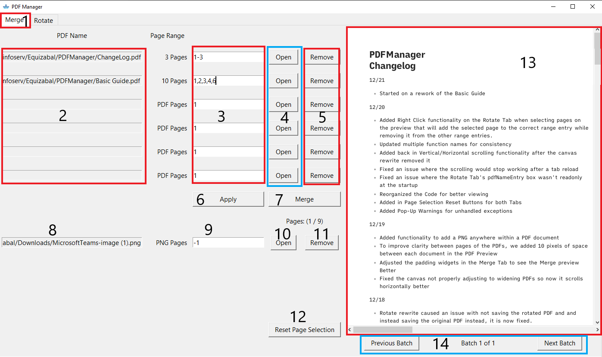

# What Is This
---
PDFManager is a program made by Broward Health's Local Friendly IT Team(Field Services FTW) to help with the basic needs of working with PDF files.

It is meant to merge PDFs, remove pages from PDFs, rotate pages within PDFs, append a screenshot (PNG Image Specifically), and add already existing PDF pages to duplicate or take from one PDF to put in another one.

It _DOES NOT_ create brand new PDF pages or alter content within a PDF page. There might be other things possibly expected, but unless it is on the above list, it is unknown if that functionality will ever be supported.

If you run into any issues using the program, have suggestions to improve it, or have anything else relevant regarding this program, please let me know and I will try and take a look to fix it.

Email: neguizabal@browardhealth.org
You can find me on Teams as well, Nicholas Eguizabal.

> _Note: Pressing the Escape key while the program is selected will close the program!_

Merge
---
The Merge tab is used for
- Combining PDFs
- Removing Pages from PDFs
- Reorganizing PDFs
- Appending a Screenshot (PNG Only) to a PDF

### 1. Merge Tab
> Select this tab to open the Merge Tab if it is not already open
### 2. PDF Name/File Path
> Displays the file path of any PDFs you open.
> PDFs will be merged in order from the topmost open PDF to the lowest open row. Rows can be skipped without issue.
### 3. PDF Page Selection
> You can select which pages you want to display for the PDF on the same row, how many times to display a page, and in what order you want to display the pages.
> You can input a _range_ of pages in the format of _FirstPage-LastPage_, where _FirstPage_ is a smaller number than _LastPage_.
> You can also chain multiple _ranges_ together by separating the ranges by a comma, _FirstPageRange1-LastPageRange1,FirstPageRange2-LastPageRange2_.
#### Range Examples 
| Example Input | Pages Displayed                             |
| ------------- | ------------------------------------------- |
| 1-4           | 1,2,3,4                                     |
| 5-6           | 5,6                                         |
| 3-1           | Will Not Display   |
| 1-2-3         | Will Only Display Pages 1, 2 (Just do 1-3)  |
| 1-2,4-6       | 1, 2, 4, 5, 6                                  |
> You can also input individual pages by inputting the page followed by a comma, _Page1, Page2, Page3_. This needs to be in the the order you want the pages to appear. If you put the same page down multiple times, it will display multiple times as well.
#### Individual Page Examples
| Example Input | Pages Displayed |
| ------------- | --------------- |
| 1,3,5         | 1, 3, 5         |
| 2, 4          | 2, 4            |
| 5, 1,2        | 5, 1, 2         |
| 1, 1, 2       | 1, 1, 2         |
> To apply changes created by changing the Page Selection, you will need to press the "Apply Button".
### 4. Open Buttons
> These buttons open a File Dialog Box to select a PDF. 
> Once you have selected your pdf, it will populate the [[#2. PDF Name/File Path|PDF Name]] box within the same row and update the [[#13. PDF Preview|PDF Preview]].
> When you open a PDF, it resets the [[README#3. PDF Page Selection|PDF Page Selection]] within the same row to select all pages in the opened PDF.
### 5. Remove Buttons
> These buttons will remove the PDF within the same row
> 	- Clear the [[#2. PDF Name/File Path|PDF Name]] 
> 	- Reset the [[README#3. PDF Page Selection|PDF Page Selection]] back to default 
> 	- And update the [[#PDF Preview|PDF Preview]] to no longer show the removed PDF.

### 6. Apply Button
> This button will check for any changes within all of the [[#3. PDF Page Selection|PDF Page Selections]] or the [[#PNG Page Insertion|PNG Page Insertion]] and update the [[#PDF Preview|PDF Preview]] to reflect those changes.

### 7. Merge Button
> This button will open a File Dialog Box to name and save the [[#13. PDF Preview|PDF Preview]] as a new PDF.
> __Use this to save your PDFs! No files are altered or saved until this button has been pressed!__

### 8. PNG Name/Path
> Displays the Name/File Path of the PNG opened.
> Screenshots taken with the Windows Snipping Tool are PNG files, they can be added here.

### 9. PNG Page Insertion
> You can select what page of the overall PDF you want the opened PNG to be placed in.
> Defaults to -1, meaning it will be placed as the last page of the PDF.

### 10. PNG Open Button
> This Button opens a File Dialog Box to select a PNG. 
> Once you have selected your PNG, it will populate the [[#8. PNG Name/Path|PNG Name/Path]] box and update the preview to display the PNG if you have another PDF opened.
> Sets the [[#9. PNG Page Insertion|PNG Page Insertion]] to -1.

### 11. PNG Remove Button
> This button clears the [[#8. PNG |PNG Name]] and [[#9. PNG Insertion Point|PNG Insertion Point]].
> It will also update the PDF preview to remove the PNG.

### 12. Reset Page Selection Button
> This button resets all changes to the [[#9. PNG Insertion Point|PNG Insertion Point]] and the [[#3. PDF Page Selection|PDF Page Selections]] boxes so they go back to default values.

### 13. PDF Preview
> This displays a preview of the PDF created from the selected pages of the open PDFs.

### 14. Batch Selection
> For the health of your computer, PDF files that are larger than 100 pages are broken down into "Batches" of 100 pages each.
> Use the "Next Batch" and "Previous Batch" buttons to navigate between which 100 page section you would like to view.
> The currently viewed batch does not change the [[#3. PDF Page Selection|PDF Page Selection]].

### Removing/Duplicating Pages from PDFs
]
## Combining PDFs

To combine multiple PDFs into a single PDF, it is pretty much the same process as Removing or Duplicating pages except now you use multiple PDFs.

Now, you just need to open multiple PDFs you want to merge.

![[Merge PDF Order.png]]

As you can see above, the PDFs are merged in the order they are selected but you can skip spaces if you may want to add in a different pdf later. It will ignore empty rows.

![[Merge Box Skip.png]]

Remember to press the "Apply" button when you make changes to the Page Ranges.
Press the "Merge" button when you are satisfied then choose where to save the new PDF and give it a name.

### Reorganizing PDFs
If you need to change the order of the pages within a PDF, refer back to [[README#Individual Page Examples]]. 

![[Merge Page Reordering.png]]

## Rotate
---
1.) Make sure you are on the "Rotate" tab
![[Pasted image 20231215133146.png]]

2.) Open the PDF you want to edit with the "Open" Button
![[Pasted image 20231215133201.png]]

3.) Figure out what pages you want to rotate and input them into the correct entry box
![[Pasted image 20231215133405.png]]

4.) Press the "Apply Rotate" button and the preview will update
![[Pasted image 20231215133643.png]]

> _Note: The rotations will be applied in descending order! If page 1 is set to rotate 90° and then is also set to rotate -90° afterwards, it will be rotated a grand total of 0°._

5.) Press the "Save As" button when you are satisfied with the preview and you will be prompted to name and select where you will save the file.
![[Pasted image 20231215133926.png]]
